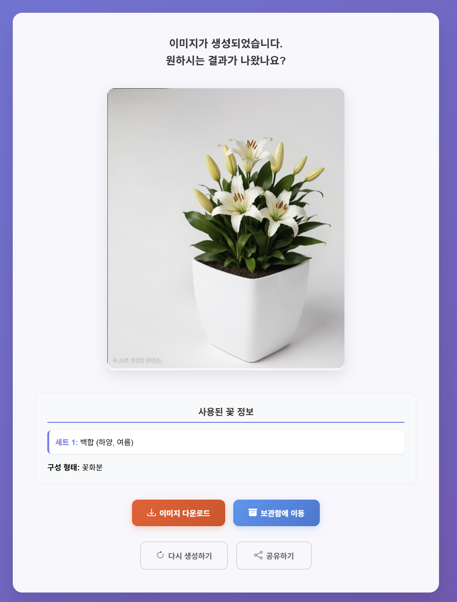
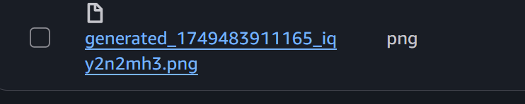
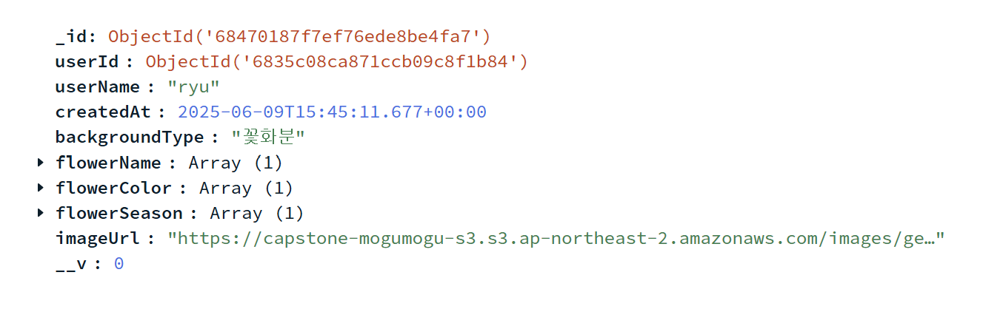

# capstone-portfolio

openai vision api 와 stability ai 기반으로 만든 inpaint 꽃 이미지 생성입니다.

## 팀 프로젝트에서 맡았던 부분
ai api를 활용하여 inpaint 꽃 이미지 생성 파트를 맡았습니다.
그 이외에 s3, mongodb도 기여하였습니다.

## 작동 흐름 방식
HTML -> server.js -> api gateway -> aws lamda ->
openai로 알맞는 프롬프트로 변경후 -> inpaint stability ai 이미지 생성 ->
s3와 mongodb 저장

## 시각적 흐름 과정

